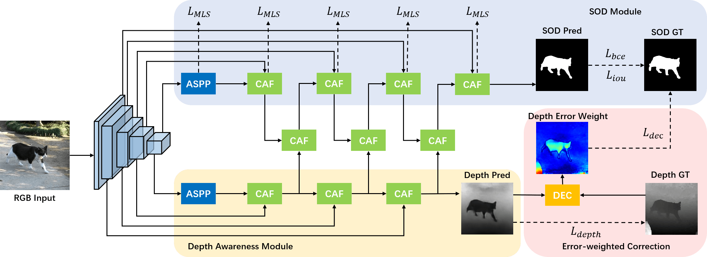

# DASNet
Is Depth Really Necessary for Salient Object Detection?  ACM MM 2020

Please see details in [http://cvteam.net/projects/2020/DASNet/](http://cvteam.net/projects/2020/DASNet/)

## Introduction

Salient object detection (SOD) is a crucial and preliminary task for many computer vision applications, which have made progress with deep CNNs. Most of the existing methods mainly rely on the RGB information to distinguish the salient objects, which faces difficulties in some complex scenarios. To solve this, many recent RGBD-based networks are proposed by adopting the depth map as an independent input and fuse the features with RGB information. Taking the advantages of RGB and RGBD methods, we propose a novel depth-aware salient object detection framework, which has following superior designs: 1) It does not rely on depth data in the testing phase. 2) It comprehensively optimizes SOD features with multi-level depth-aware regularizations. 3) The depth information also serves as error-weighted map to correct the segmentation process. **With these insightful designs combined, we make the first attempt in realizing an unified depth-aware framework with only RGB information as input for inference, which not only surpasses the state-of-the-art performance on five public RGB SOD benchmarks, but also surpasses the RGBD-based methods on five benchmarks by a large margin, while adopting less information and implementation light-weighted.**